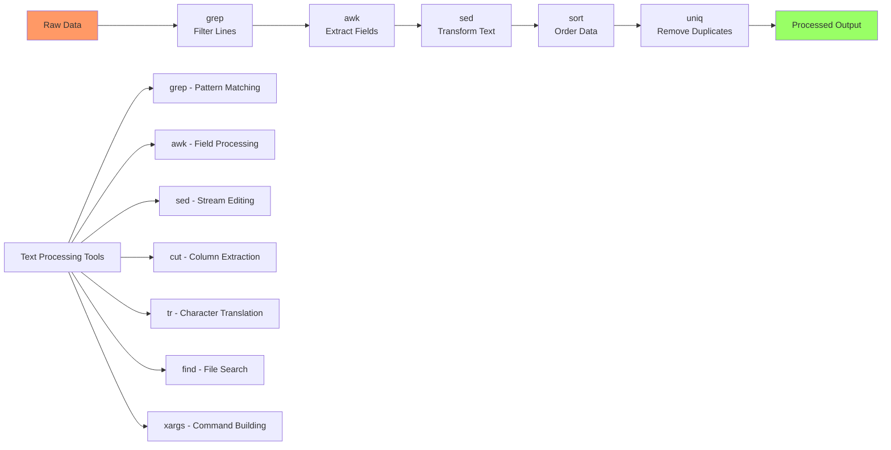

# Day 06: Advanced Linux Commands

## Learning Objectives
By the end of Day 6, you will:
- Master advanced text processing with grep, awk, and sed
- Use find and xargs for file operations
- Combine commands with pipes for powerful one-liners
- Process and manipulate text data efficiently
- Apply these tools in real DevOps scenarios

**Estimated Time:** 1 hour

## Sample Dataset: sample.log

We'll use the following log file, `sample.log`, for all command examples and exercises:

```
2025-10-07 10:10:10 INFO  user1 192.168.0.1 Login successful
2025-10-07 10:12:15 WARN  user2 10.0.0.2 Disk space low
2025-10-07 10:13:25 ERROR user3 172.16.0.2 Failed password attempt
2025-10-07 10:15:40 INFO  user1 192.168.0.1 File uploaded
2025-10-07 10:17:50 ERROR user4 203.0.113.25 Connection lost
2025-10-07 10:18:30 INFO  user2 10.0.0.2 Logout
2025-10-07 10:19:50 INFO  user5 172.16.0.3 Login successful
2025-10-07 10:20:55 WARN  user1 192.168.0.1 High CPU usage
```

## Notes

- **Why Learn Advanced Linux Commands?**
  - These commands are essential for text processing, automation, and efficient system administration.
  - Mastery of these tools is expected in DevOps, SRE, and system engineering interviews.



---

### grep (Global Regular Expression Print)
**grep** is used to search for patterns within text files. It can filter lines that match (or don’t match) a specified string or regular expression. Perfect for quickly locating information in logs or data files.

```bash
# Search for ERROR log entries
grep 'ERROR' sample.log

# Case insensitive search for "login"
grep -i 'login' sample.log

# Get all lines for user1
grep 'user1' sample.log

# Show line numbers for WARN
grep -n 'WARN' sample.log
```

---

### awk
**awk** is a powerful text-processing tool for extracting and manipulating columns or fields in files. It can filter, calculate, and reformat data, making it ideal for analyzing logs and reports.

```bash
# Print the username and IP address columns
awk '{print $4, $5}' sample.log

# Print only ERROR log lines' usernames
awk '$3 == "ERROR" {print $4}' sample.log

# Count number of lines per log level
awk '{count[$3]++} END {for (level in count) print level, count[level]}' sample.log
```

---

### sed (Stream Editor)
**sed** is used for editing text in a stream or file. It’s commonly used for find-and-replace jobs, deleting or inserting lines, and performing quick edits to large files—all from the command line.

```bash
# Replace "user1" with "admin"
sed 's/user1/admin/g' sample.log

# Delete all INFO lines
sed '/INFO/d' sample.log

# Print lines 2 to 5
sed -n '2,5p' sample.log
```

---

### find & xargs
**find** is used to search for files and directories based on name, type, size, modification time, etc. **xargs** takes output from one command (like find or grep) and builds/executed another command with it—perfect for batch processing files found by find.

Assume you have several log files in your current directory (sample.log, app.log, system.log):

```bash
# Find all .log files in current directory
find . -name '*.log'

# Search for "ERROR" in all .log files
find . -name '*.log' -exec grep 'ERROR' {} +

# Remove all .log files containing "Disk space low"
grep -l 'Disk space low' *.log | xargs rm
```

---

### cut, sort, uniq, tr
- **cut** extracts columns or character ranges from each line of a file.
- **sort** arranges lines in order (alphabetical/numerical).
- **uniq** removes adjacent duplicate lines, often used after sort.
- **tr** translates or deletes characters.

These are essential for extracting and cleaning up data.

```bash
# Extract only IP addresses (column 5)
cut -d' ' -f5 sample.log

# Show unique usernames
awk '{print $4}' sample.log | sort | uniq

# Count unique IP addresses
awk '{print $5}' sample.log | sort | uniq | wc -l

# Convert usernames and log levels to uppercase
awk '{print $3, $4}' sample.log | tr 'a-z' 'A-Z'
```

---

## Extract IP Addresses

Extracting IP addresses from log files is a common task, whether working with web server logs or application logs. This can be done with awk (field extraction) or grep (regex matching).

### Example 1: Web server logs (access.log)

```bash
# Sample log entries (web server format)
echo "172.16.0.2 - - [01/Oct/2025:19:10:00 +0530] \"GET /about HTTP/1.1\" 200 2048" >> access.log
echo "203.0.113.25 - - [01/Oct/2025:19:15:00 +0530] \"POST /submit HTTP/1.1\" 404 256" >> access.log

# Method 1: Using grep with regex pattern to extract IP addresses
grep -oE '([0-9]{1,3}\.){3}[0-9]{1,3}' access.log

# Method 2: Using awk to extract the first field (IP address)
awk '/[0-9]+\.[0-9]+\.[0-9]+\.[0-9]+/ {print $1}' access.log
```

### Example 2: Course sample logs (sample.log)

We'll use the provided sample.log (see top of these notes) for all course command demos.

```bash
# Extract IP addresses (column 5) using awk
awk '{print $5}' sample.log

# Extract IP addresses with grep regex (matches any IP-like pattern)
grep -oE '([0-9]{1,3}\.){3}[0-9]{1,3}' sample.log

# Extract only unique IP addresses
awk '{print $5}' sample.log | sort | uniq
```

---

## Sample Exercises

1. Search for all ERROR log entries.
2. Print all unique usernames found in the logs.
3. Replace every "user1" with "admin" in the log file.
4. Count how many times each log level appears.
5. Extract all unique IP addresses.
6. Extract all IP addresses from sample.log and from access.log (if available).
7. Print lines 3 through 6 of the sample.log file.
8. Delete all INFO entries from the log file (output to a new file).

---

## Solutions

1. **Search for ERROR log entries:**
   ```bash
   grep 'ERROR' sample.log
   ```

2. **Print unique usernames:**
   ```bash
   awk '{print $4}' sample.log | sort | uniq
   ```

3. **Replace every "user1" with "admin":**
   ```bash
   sed 's/user1/admin/g' sample.log > new_sample.log
   ```

4. **Count number of lines per log level:**
   ```bash
   awk '{count[$3]++} END {for (level in count) print level, count[level]}' sample.log
   ```

5. **Extract all unique IP addresses:**
   ```bash
   awk '{print $5}' sample.log | sort | uniq
   ```

6. **Extract IP addresses:**
   - From sample.log:
     ```bash
     awk '{print $5}' sample.log
     grep -oE '([0-9]{1,3}\.){3}[0-9]{1,3}' sample.log
     ```
   - From access.log (web server log):
     ```bash
     grep -oE '([0-9]{1,3}\.){3}[0-9]{1,3}' access.log
     awk '/[0-9]+\.[0-9]+\.[0-9]+\.[0-9]+/ {print $1}' access.log
     ```

7. **Print lines 3 through 6:**
   ```bash
   sed -n '3,6p' sample.log
   ```

8. **Delete all INFO entries (output to new file):**
   ```bash
   sed '/INFO/d' sample.log > no_info_sample.log
   ```

---

## Completion Checklist
- [ ] Can use grep with various options for text searching
- [ ] Understand awk for column processing and calculations
- [ ] Use sed for text replacement and line operations
- [ ] Master find for file searching with multiple criteria
- [ ] Combine commands with pipes and xargs
- [ ] Can create complex one-liners for data processing

---

## Key Command Combinations

```bash
# Find all ERROR lines and show unique users
grep 'ERROR' sample.log | awk '{print $4}' | sort | uniq

# Count how many times each IP appears
awk '{print $5}' sample.log | sort | uniq -c

# Remove all .log files older than 7 days
find . -name "*.log" -mtime +7 | xargs rm
```

---

## Best Practices
- Test commands on sample data first
- Use `--help` or `man` pages to learn options
- Combine simple commands for complex tasks
- Use `-i` flags carefully (they modify files in place)
- Always backup important files before bulk operations

---

## Sample Interview Questions

1. How do you search for a specific word in a log file?
2. How do you print specific columns from a text file?
3. How do you replace text in a file using sed?
4. How do you count unique entries in a column?
5. How do you process multiple files matching a pattern?
6. How do you delete lines containing a certain pattern?
7. How do you combine commands to get unique IPs from error logs?
8. How do you use tr for string manipulation?
9. How do you print a range of lines from a file?
10. How do you chain commands with pipes?

---

## Interview Question Answers

1. `grep 'word' sample.log`
2. `awk '{print $2, $4}' sample.log`
3. `sed 's/oldtext/newtext/g' sample.log`
4. `awk '{print $4}' sample.log | sort | uniq -c`
5. `find . -name '*.log' -exec command {} +`
6. `sed '/pattern/d' sample.log`
7. `grep 'ERROR' sample.log | awk '{print $5}' | sort | uniq`
8. `echo "text" | tr 'a-z' 'A-Z'`
9. `sed -n '3,6p' sample.log`
10. `grep 'ERROR' sample.log | awk '{print $4}' | sort | uniq`

---

## Next Steps
Proceed to [Day 7: Users, Groups & Permissions](../Day_07/notes_and_exercises.md) to learn user management and security.
