# Day 17: Package Management (apt, yum, dnf, rpm)
## Overview
**Estimated Time:** 30 mins

## Table of Contents

- [Day 17: Package Management (apt, yum, dnf, rpm)](#day-17-package-management-apt-yum-dnf-rpm)
  - [Learning Objectives](#learning-objectives)
  - [Notes](#notes)
  - [Sample Exercises](#sample-exercises)
  - [Solutions](#solutions)
  - [Sample Interview Questions](#sample-interview-questions)
  - [Interview Question Answers](#interview-question-answers)
  - [Completion Checklist](#completion-checklist)
  - [Key Commands Summary](#key-commands-summary)
- [APT (Debian/Ubuntu)](#apt-debianubuntu)
- [YUM/DNF (RHEL/CentOS/Fedora)](#yumdnf-rhelcentosfedora)
- [Universal](#universal)
  - [Best Practices](#best-practices)
  - [Next Steps](#next-steps)


## Learning Objectives
By the end of Day 17, you will:
- Master package management across different Linux distributions
- Install, update, and remove software packages
- Manage repositories and package sources
- Troubleshoot package-related issues
- Understand package dependencies and conflicts

**Estimated Time:** 3-4 hours

## Notes
- **Why Package Management Matters:**
  - Ensures easy installation, updating, and removal of software.
  - Critical for system security, stability, and automation.

```mermaid
flowchart TD
    A[Package Management] --> B[Debian Family]
    A --> C[Red Hat Family]
    A --> D[Universal Packages]
    A --> E[Package Operations]
    
    B --> B1[apt<br/>High-level Tool]
    B --> B2[dpkg<br/>Low-level Tool]
    B --> B3[.deb Packages]
    B --> B4[Ubuntu PPAs]
    
    C --> C1[dnf/yum<br/>High-level Tool]
    C --> C2[rpm<br/>Low-level Tool]
    C --> C3[.rpm Packages]
    C --> C4[EPEL Repository]
    
    D --> D1[snap<br/>Universal Packages]
    D --> D2[flatpak<br/>Sandboxed Apps]
    D --> D3[AppImage<br/>Portable Apps]
    
    E --> E1[Install/Remove]
    E --> E2[Update/Upgrade]
    E --> E3[Search/List]
    E --> E4[Repository Management]
    E --> E5[Dependency Resolution]
    
    F[Package Sources] --> F1[Official Repositories]
    F --> F2[Third-party Repos]
    F --> F3[Local Files]
    F --> F4[Source Code]
    
    G[Security] --> G1[GPG Verification]
    G --> G2[Package Signatures]
    G --> G3[Trusted Sources]
    
    style A fill:#f96
    style E fill:#9f6
    style G fill:#69f
```



- **Debian/Ubuntu Tools:**
  - `apt update`, `apt upgrade`, `apt install <pkg>`, `apt remove <pkg>`, `apt search <pattern>`, `apt show <pkg>`, `apt list --installed`
  - `dpkg -i <file.deb>`, `dpkg -r <pkg>`, `dpkg -l`, `dpkg -L <pkg>`
- **Red Hat/CentOS/Fedora Tools:**
  - `yum install <pkg>`, `yum remove <pkg>`, `yum update`, `yum search <pattern>`, `yum info <pkg>`
  - `dnf` (Fedora/RHEL 8+): Same as yum, newer features
  - `rpm -i <file.rpm>`, `rpm -e <pkg>`, `rpm -q <pkg>`, `rpm -ql <pkg>`
- **Universal Tools:**
  - `snap install <pkg>`, `snap remove <pkg>`, `snap list`, `snap info <pkg>`
  - `flatpak install <remote> <pkg>`, `flatpak list`

- **Repositories:**
  - Official repos are safest; third-party repos can introduce risk
  - Add repos: `add-apt-repository`, edit `/etc/apt/sources.list`, or use `yum-config-manager`
  - Update GPG keys for secure package verification

- **Best Practices:**
  - Always update package lists before installing
  - Remove unused packages (`apt autoremove`, `yum autoremove`)
  - Check package signatures and sources
  - Prefer official repos for security
  - Document all changes to system packages


- **Package Management Comparison:**
  ```bash
  # Debian/Ubuntu (APT)
  apt update                       # Update package lists
  apt upgrade                      # Upgrade packages
  apt install package             # Install package
  apt remove package              # Remove package
  apt search pattern              # Search packages
  
  # RHEL/CentOS/Fedora (YUM/DNF)
  yum update                      # Update packages
  yum install package             # Install package
  yum remove package              # Remove package
  yum search pattern              # Search packages
  
  # Low-level tools
  dpkg -i package.deb             # Install .deb file
  rpm -i package.rpm              # Install .rpm file
  ```

- **Repository Management:**
  ```bash
  # Add repositories
  add-apt-repository ppa:user/repo        # Ubuntu PPA
  yum-config-manager --add-repo url       # YUM repo
  
  # Repository files
  /etc/apt/sources.list                   # APT sources
  /etc/yum.repos.d/                       # YUM repositories
  ```

## Sample Exercises
1. Install, update, and remove a package using `apt` and `yum`.
2. List all installed packages and search for a specific one.
3. Install a `.deb` and a `.rpm` package manually.
4. Use `snap` to install and remove a package.
5. Clean up unused packages and cache.
6. Show all files installed by a specific package.
7. Find out which package provides a specific file or command.
8. Enable and use a third-party repository.

## Solutions
1. **Package operations:**
   ```bash
   # Debian/Ubuntu
   apt update && apt install nginx
   apt upgrade
   apt remove nginx
   
   # RHEL/CentOS
   yum install httpd
   yum update
   yum remove httpd
   ```
=======

Package management is essential for installing, updating, and maintaining software on Linux systems. Different distributions use different tools, but the concepts remain similar.

### Why It Matters
- Simplifies software installation and updates
- Ensures system security through verified packages
- Manages dependencies automatically
- Critical for system administration and automation

---

## Package Management by Distribution

### Debian/Ubuntu Family (apt/dpkg)
**High-Level Tool:** `apt` (manages repositories and dependencies)
```bash
# Update & Upgrade
apt update                          # Refresh package lists
apt upgrade                         # Install available updates
apt full-upgrade                    # Upgrade with dependency changes

# Install & Remove
apt install nginx                   # Install package
apt remove nginx                    # Remove package (keep config)
apt purge nginx                     # Remove package and config
apt autoremove                      # Remove unused dependencies

# Search & Information
apt search "web server"             # Search packages
apt show nginx                      # Show package details
apt list --installed                # List installed packages
apt list --upgradable               # Show available updates
```

**Low-Level Tool:** `dpkg` (handles .deb files directly)
```bash
dpkg -i package.deb                 # Install .deb file
dpkg -r package                     # Remove package
dpkg -l                             # List all packages
dpkg -L nginx                       # List files from package
dpkg -S /usr/sbin/nginx            # Find package owning file
```

### Red Hat/CentOS/Fedora Family (yum/dnf/rpm)
**High-Level Tool:** `yum` (RHEL/CentOS) or `dnf` (Fedora/RHEL 8+)
```bash
# Update & Upgrade
yum update                          # Update all packages
yum check-update                    # Check for updates

# Install & Remove
yum install httpd                   # Install package
yum remove httpd                    # Remove package
yum autoremove                      # Remove unused dependencies

# Search & Information
yum search "web server"             # Search packages
yum info httpd                      # Show package details
yum list installed                  # List installed packages

# Note: dnf commands are identical to yum
dnf install package                 # Same syntax as yum
```

**Low-Level Tool:** `rpm` (handles .rpm files directly)
```bash
rpm -ivh package.rpm                # Install .rpm file (verbose)
rpm -Uvh package.rpm                # Upgrade package
rpm -e package                      # Remove package
rpm -qa                             # List all packages
rpm -ql httpd                       # List files from package
rpm -qf /usr/sbin/httpd            # Find package owning file
```

### Universal Package Formats

**Snap (Canonical)**
```bash
snap install vlc                    # Install snap package
snap list                           # List installed snaps
snap refresh                        # Update all snaps
snap remove vlc                     # Remove snap
snap info vlc                       # Show package info
```

**Flatpak (Cross-distribution)**
```bash
flatpak install flathub org.gimp.GIMP    # Install from remote
flatpak list                              # List installed apps
flatpak update                            # Update all flatpaks
flatpak uninstall org.gimp.GIMP          # Remove flatpak
```

**AppImage (Portable)**
```bash
chmod +x application.AppImage       # Make executable
./application.AppImage              # Run directly (no install)
```

---

## Repository Management

### Debian/Ubuntu
```bash
# Add PPA (Ubuntu)
add-apt-repository ppa:nginx/stable
apt update

# Edit sources manually
sudo nano /etc/apt/sources.list

# Add GPG keys
wget -qO - https://example.com/key.gpg | apt-key add -
```

### RHEL/CentOS/Fedora
```bash
# Add repository
yum-config-manager --add-repo https://example.com/repo

# Enable EPEL (Extra Packages for Enterprise Linux)
yum install epel-release

# Repository files location
ls /etc/yum.repos.d/
```

---

## Common Tasks Cheat Sheet

| Task | Debian/Ubuntu | RHEL/CentOS/Fedora |
|------|---------------|-------------------|
| Update package lists | `apt update` | `yum check-update` |
| Upgrade packages | `apt upgrade` | `yum update` |
| Install package | `apt install pkg` | `yum install pkg` |
| Remove package | `apt remove pkg` | `yum remove pkg` |
| Search packages | `apt search term` | `yum search term` |
| Show package info | `apt show pkg` | `yum info pkg` |
| List installed | `apt list --installed` | `yum list installed` |
| Clean cache | `apt clean` | `yum clean all` |
| Remove unused deps | `apt autoremove` | `yum autoremove` |

---

## Practical Exercises

### Exercise 1: Basic Package Operations
```bash
# Update system
sudo apt update && sudo apt upgrade    # Ubuntu
sudo yum update                        # CentOS

# Install a web server
sudo apt install nginx                 # Ubuntu
sudo yum install httpd                 # CentOS

# Check if running
systemctl status nginx                 # Ubuntu
systemctl status httpd                 # CentOS

# Remove package
sudo apt remove nginx                  # Ubuntu
sudo yum remove httpd                  # CentOS
```

### Exercise 2: Package Information
```bash
# Search for packages
apt search text editor
yum search text editor

# Show package details
apt show vim
yum info vim

# List all installed packages
apt list --installed | wc -l
rpm -qa | wc -l

# Find which package owns a file
dpkg -S /usr/bin/vim
rpm -qf /usr/bin/vim
```

### Exercise 3: Manual Package Installation
```bash
# Download package
wget https://example.com/package.deb    # Debian
wget https://example.com/package.rpm    # Red Hat

# Install manually
sudo dpkg -i package.deb
sudo rpm -ivh package.rpm

# Fix missing dependencies (if needed)
sudo apt --fix-broken install
sudo yum install package  # Will resolve deps
```

### Exercise 4: Repository Management
```bash
# Add a third-party repository
sudo add-apt-repository ppa:ondrej/php
sudo apt update

# List repositories
cat /etc/apt/sources.list
ls /etc/apt/sources.list.d/
ls /etc/yum.repos.d/

# Remove repository
sudo add-apt-repository --remove ppa:ondrej/php
```

### Exercise 5: System Cleanup
```bash
# Remove unused packages
sudo apt autoremove
sudo yum autoremove

# Clean package cache
sudo apt clean
sudo apt autoclean
sudo yum clean all

# List orphaned packages (Debian)
deborphan
```

---

## Interview Questions & Answers

**Q1: What's the difference between apt and dpkg?**
- `apt` is a high-level tool that manages repositories, resolves dependencies, and handles multiple packages
- `dpkg` is a low-level tool that installs individual .deb files without dependency resolution

**Q2: How do you install a local .deb or .rpm file?**
```bash
sudo dpkg -i package.deb     # Debian
sudo rpm -i package.rpm      # Red Hat
```

**Q3: What are the advantages of snap/flatpak?**
- Cross-distribution compatibility
- Sandboxed applications for better security
- Bundled dependencies (no version conflicts)
- Automatic updates
- Easy rollback to previous versions

**Q4: How do you find which package provides a specific file?**
```bash
dpkg -S /path/to/file        # Debian
rpm -qf /path/to/file        # Red Hat
apt-file search filename     # Search all packages
yum provides */filename      # Search all packages
```

**Q5: What's the difference between `apt update` and `apt upgrade`?**
- `apt update`: Refreshes the package list from repositories (doesn't install anything)
- `apt upgrade`: Installs available updates for installed packages
- Always run `apt update` before `apt upgrade`

**Q6: How do you troubleshoot broken package installations?**
```bash
# Debian/Ubuntu
sudo apt --fix-broken install
sudo dpkg --configure -a
sudo apt clean && sudo apt update

# RHEL/CentOS
sudo yum clean all
sudo yum check
sudo yum-complete-transaction

# Check logs
tail -f /var/log/apt/term.log        # Ubuntu
tail -f /var/log/yum.log             # CentOS
```

**Q7: What are the security risks of third-party repositories?**
- Unverified packages may contain malware
- Package conflicts with official repos
- Updates may stop if repo is abandoned
- May compromise system stability
- Potential for privilege escalation

**Q8: How do you verify package authenticity?**
```bash
# Check GPG signature
apt-key list                         # List trusted keys
rpm --checksig package.rpm          # Verify RPM signature

# Verify package integrity
dpkg --verify package
rpm -V package
```

---

## Best Practices

1. **Always update before installing**
   ```bash
   sudo apt update && sudo apt install package
   ```

2. **Use official repositories when possible**
   - More secure and stable
   - Better tested and maintained

3. **Regular system updates**
   ```bash
   sudo apt update && sudo apt upgrade -y
   sudo yum update -y
   ```

4. **Clean up regularly**
   ```bash
   sudo apt autoremove && sudo apt autoclean
   sudo yum autoremove && sudo yum clean all
   ```

5. **Document changes**
   - Keep a log of installed packages
   - Note custom repositories added
   - Track configuration changes

6. **Test in non-production first**
   - Use staging environments
   - Create VM snapshots before major updates

---

## Completion Checklist

- [ ] Can install/remove packages on both Debian and Red Hat systems
- [ ] Understand repository management and how to add sources
- [ ] Know how to search for packages and show information
- [ ] Can troubleshoot broken packages and dependency issues
- [ ] Familiar with snap, flatpak, and AppImage formats
- [ ] Understand package security and verification
- [ ] Can clean up unused packages and cache

---

## Quick Reference Card

```bash
# Essential Commands (works on most systems)
sudo apt update                 # Refresh package lists
sudo apt upgrade               # Install updates
sudo apt install <package>     # Install package
sudo apt remove <package>      # Remove package
apt search <term>              # Search packages
apt list --installed           # List installed

# Alternative for RHEL/CentOS
sudo yum update                # Update system
sudo yum install <package>     # Install package
sudo yum remove <package>      # Remove package
yum search <term>              # Search packages
```

---

## Next Steps
Ready to configure web servers? Proceed to **[Day 18: Web Servers](../Day_18/notes_and_exercises.md)**
